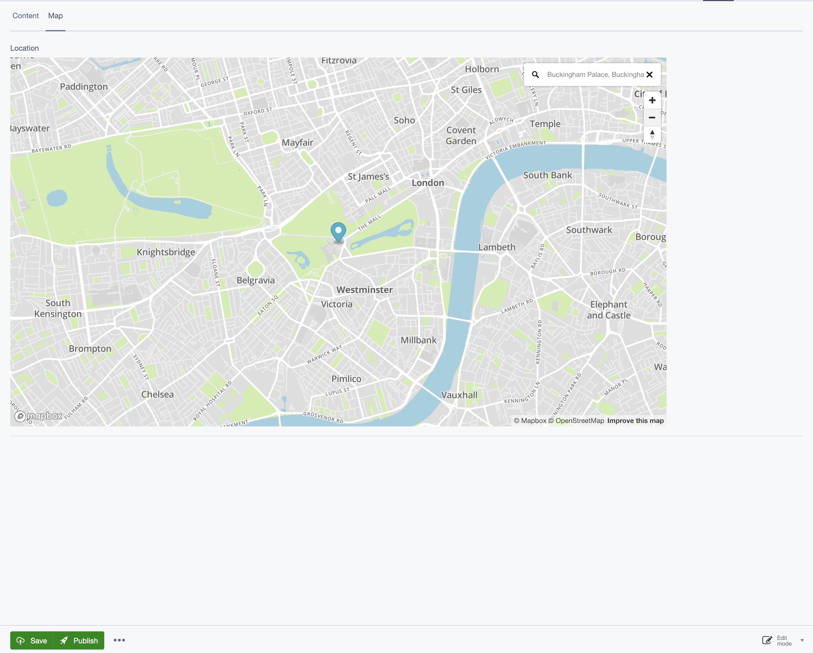

# SilverStripe Mapbox Field

Adds a Mapbox map to the CMS with a draggable marker to allow content authors to add a location to a DataObject or Page.



## Installation

`composer require bigfork/silverstripe-mapboxfield:*`

## Configuration

```yml
---
Name: 'app-mapbox'
After: 'silverstripe-mapboxfield'
---
Bigfork\SilverStripeMapboxField\MapboxField:
  access_token: '<your mapbox key>'
```

## Usage

```php
class MyDataObject extends DataObject
{
    private static $db = [
        'Latitude' => 'Decimal(10, 8)',
        'Longitude' => 'Decimal(10, 8)'
    ];

    public function getCMSFields()
    {
        // ...

        $fields->addFieldToTab(
            'Root.Map',
            MapboxField::create('LocationMap', 'Choose a location', 'Latitude', 'Longitude')
        );

        // ...
    }
}
```
